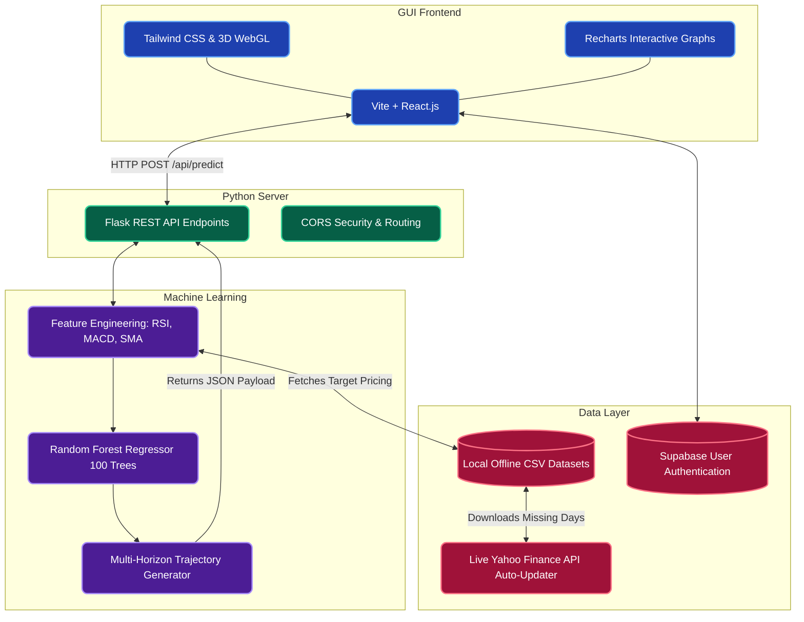
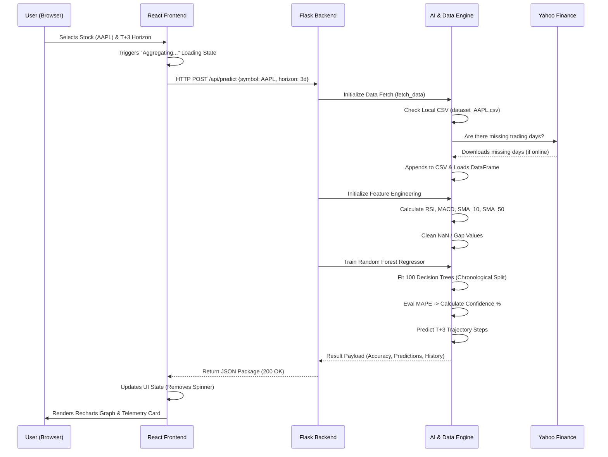

# Predictifi.AI - System Architecture & Block Diagrams

Here are two professional flowcharts documenting your exact project. You can take a screenshot of these directly for your PowerPoint presentation!

### 1. High-Level System Architecture (Block Diagram)
This diagram shows the complete full-stack environment, broken down into its 4 main layers: Frontend, Backend API, Machine Learning Engine, and Data.

***

### 2. Live Prediction Request Cycle (Flowchart)
This flowchart describes the exact step-by-step logic the system executes when a user clicks the "Initiate Sequence" button on your frontend. 

